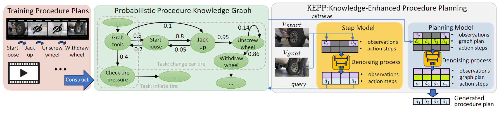

## Procedure Planning in Instructional Videos    2019

> 1. InfoGAN & UPN
> 2. motivation

1. **目的**: learn **structured and plannable state and action spaces** directly from **unstructured videos**, perform procedure planning in the **learned latent space**.
2. **方法** (leveraging the **conjugate relationships** between states and actions to impose **structured priors**): 
   * **Forward Dynamics**: $T(x_{t+1}|x_t,\bar{a}_t)$
   * **Conjugate Dynamics** (satisfy the precondition of next action): $P(\bar{a}_t|x_t,\bar{a}_{t-1})$

* **$f, g$**: **MLP**
* $T$: **MLP**
* $P$: **RNN**, concat with goal embedding 


## Procedure Planning in Instructional Videos via Contextual Modeling and Model-based Policy Learning    2021

3. **建模**：$p(a_{1:T} \mid o_1, o_T) = \iint p(a_{1:T}, s_{1:T} \mid z_c) p(z_c \mid o_1, o_T) \, \mathrm{d}s_{1:T} \, \mathrm{d}z_c$

* **Inference Model** (**variational inference** to approximate **posterior distribution**): **VAE**
* **Generation Model**: $p(a_{1:T}, s_{1:T} \mid z_c) = \prod_{t=1}^{T} \pi_{\theta}(a_t \mid s_t) \mathcal{T}_{\mu}(s_t \mid z_c, s_{t-1}, a_{t-1})$
  * 


## PlaTe: Visually-Grounded Planning with Transformers in Procedural Tasks    2021

1. **解决的问题**：the **appearance gap** between the training and validation datasets could be large; **error compound** over steps  (single step model)
2. **方法**：**simultaneously** (jointly) learns **the latent state** and **action information** of assigned tasks and the **representations of the decision-making process**

* **state encoder**: **MLP**

* **two-headed** transition model (one for **action prediction** the other for **state prediction**):
  * **input**: $[a_t;s_t]$
  * **output**: $s_{t+1}$: first $L_s$-dim features, $a_{t+1}$: decoded from the rest of transformer output
* **inference** (stochastic nature of predictions, planning is often low quality with a single roll-out): **beam search**
* **Limitation**:


## P3IV: Probabilistic Procedure Planning from Instructional Videos with Weak Supervision    2022

> 1. 文本和视觉信号表示：pre-extracted by a model trained for joint video-text embedding

1. **解决的问题**：most recent work leverages intermediate **visual observations as supervision**, which requires expensive annotation efforts to localize precisely all the instructional steps in training videos
2. **方法**：language supervision, transformer equipped with a memory module -- non-autoregressive, probabilistic generative module

* **language supervision**: more accessible, **more stable**
  * linguistic representation of intermediate steps for supervision -- **pre-trained text-video embeddings**
* **non-autoregressive transformer decoder**: (误差积累)
  * input：$Q=[q_{start}, q_1,...,q_{T-1},q_{goal}]$, first last: **representations of our initial and goal visual observations**
  * learnable memory: a collection of learnable plan embeddings shared across the entire dataset
  * two **MLP** for action and state.
  * **Loss**: InfoNCE + CE
  
* **probabilistic generative module**: model the uncertainty inherent to the prediction task
  * augment with a random noise vector
  * indistinguishable from feature sequences composed of **the ground truth language step description**
  * **Critic**: MLP
  * **Loss**: adv loss + reg loss
  
* **Inference**:
  * sample multiple procedure plans through **different latent noise vectors** & Viterbi post-processing
* **Limitation**:

```python
# TODO
```


## Skip-Plan: Procedure Planning in Instructional Videos via Condensed Action Space Learning    2023

> 1. Given the initial and goal frames as concrete inputs, it is apparent the reliabilities of the initial and final actions are the highest
> 2. MLP如何实现
> 3. decoder 输入输出维度

1. **解决的问题**：**high-dimensional state supervision** (the visual states are unstructured and high-dimensional) and **error accumulation on action sequences**. for P3IV -> neglects the links between non-adjacent actions.

2. **方法**：**decompose** long chains **into** multiple reliable **sub-chains** by **skipping** some **intermediate actions**, **sub-chain decoders** (Markov chain), **without state supervision**
3. **some analysis**: On the other hand, when models generate high-dimensional predictions such as visual images, large predictive errors are more likely to occur; Even though we can use the weak language state supervision to reduce some irrelevant dimensions, it is still too high-dimensional compared to condensed action labels

* **Loss**:  **focal loss** for individual sub-chain & complete chain: $FL(a_1,a_t,a_T)$, $FL(a_{1:T})$
* **Limitation**:

```python
# TODO
```


## Event-Guided Procedure Planning from Instructional Videos with Text Supervision    2023

> 1. aggregator 的输入

1. **解决的问题**: large semantic **gap** between **observed visual states** and **unobserved intermediate actions**. For P3IV, it is challenging to build adirect connection between observed visual states and unobserved intermediate actions, due to a large semantic gap between them (weak supervision?)
2. **方法**：event-guided (extra information), mask-and-predict approach, text representations of action labels as supervision

* observed start/goal state, ground truth action texts -> **pretrained visual-language model** -> **MLP to embed**
* **Prompting-based Feature Modeling**：**CLIP**

* **Event-Guided** (a specific event usually involves specific actions):
  * Event-Infomation Extractor: **MLP**
  * Event-Infomation Aggregator: **transformer encoder**
* **Mask-And-Predict** (model the associations between actions): DropRelation + Residual (**two masked self-attention layers followed by a FFN**)
* **Feature Extractor**: **transformer** ?

* **Loss**: $L_{action}$ (InfoNCE) + $L_{event}$ (CE)


## PDPP: Projected Diffusion for Procedure Planning in Instructional Videos    2023

1. **解决的问题**：previous work: **sequence planning** (heavy intermediate visual observations or natural language instructions as supervision)
2. **方法**: **conditional distribution fitting problem**, simply use **task labels** from instructional videos as supervision. diffusion model (model uncertainty)

3. **建模**：$p(a_{1:T}|o_s,o_g)=\int p(a_{1:T}|o_s,o_g,c)p(c|o_s,o_g)dc$

* **Condition** (task information): **MLP**
* **Learnable model**: **U-Net**
* **Conditional action sequence input** (treat conditions as additional information and concat): 

$$
\begin{bmatrix}
    c & c & \cdots & c & c \\
    a_1 & a_2 & \cdots & a_{T-1} & a_T \\
    o_s & 0 & \cdots & 0 & o_g
\end{bmatrix}
$$

* **Learning objective**: the initial input $x_0$ , (standard data generation needs more randomness)
* **Condition projection during learning** (make conditions no change): either a noise-add data or the predicted result of model

$$
\begin{bmatrix}
    \hat{c}_1 & \hat{c}_2 & \cdots & \hat{c}_T \\
    \hat{a}_1 & \hat{a}_2 & \cdots & \hat{a}_T \\
    \hat{o}_1 & \hat{o}_2 & \cdots & \hat{o}_T
\end{bmatrix}_x
\rightarrow
\begin{bmatrix}
    c & c & \cdots & c & c \\
    \hat{a}_1 & \hat{a}_2 & \cdots & \hat{a}_T \\
    o_s & 0 & \cdots & 0 & o_g
\end{bmatrix}_{\text{Proj}(x)}
$$

* **Loss**: $\mathcal{L}_{\text{diff}} = \sum_{n=1}^{N} \left( f_{\theta}(x_n, n) - x_0 \right)^2$ , **weighted**
* **Inference**: 逐步去噪、不确定性处理、模型稳定性


## Why Not Use Your Textbook? Knowledge-Enhanced Procedure Planning of Instructional Videos    2024

1. **解决的问题**：**implicit causal constraints** in the sequencing of steps and **the variability inherent** in multiple feasible plans that overlooked by previous works.
2. **方法**：infuse with procedural knowledge (directed weighted graph, textbook)
3. **建模**: $p(\hat{a}_{1:T} \mid v_s, v_g) = p(\hat{a}_{1:T} \mid \tilde{a}_{1:T}, v_s, v_g) p(\tilde{a}_{1:T} \mid \hat{a}_1, \hat{a}_T) p(\hat{a}_1, \hat{a}_T \mid v_s, v_g)$ (initial and final visual states are the most reliable)

* **Probabilistic Procedure Knowledge Graph**: **frequency-based** -> **probability distribution**      (Explicit retrieval-based)
  * multiple possible paths -> multiplying the probability weights -> top R -> linear weighting   (padding)

* **Step (Perception) Model**: conditioned projected diffusion model

$$
\left[ \begin{array}{cccc}
v_s & 0 & \cdots & 0 & v_g \\
a_1 & 0 & \cdots & 0 & a_T 
\end{array} \right]
$$

* **Planning Model**: conditioned projected diffusion model

$$
\left[ \begin{array}{cccc}
v_s & 0 & \cdots & 0 & v_g \\
\tilde{a}_1 & \tilde{a}_2 & \cdots & \tilde{a}_{T-1} & \tilde{a}_T \\
a_1 & a_2 & \cdots & a_{T-1} & a_T 
\end{array} \right]
$$

* **Limitation**



## SCHEMA: STATE CHANGES MATTER FORPROCEDURE PLANNING IN INSTRUCTIONAL VIDEOS    2024

3. **建模**: $p(a_{1:T} \mid s_0, s_T) = \int \underbrace{p(a_{1:T} \mid s_{0:T})}_{\text{step prediction}} \underbrace{p(s_{1:(T-1)} \mid s_0, s_T)}_{\text{mid-state prediction}} \, \mathrm{d}s_{1:(T-1)}$


